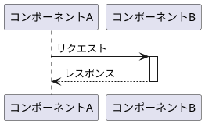
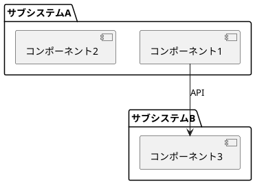
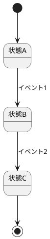
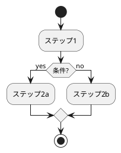

# draw.io → PlantUML 変換スキル

draw.io の XML データを PlantUML 形式に変換する。複数シートの draw.io ファイルにも対応。

## トリガー条件

- draw.io ファイル（`.drawio`, `.drawio.xml`）の変換依頼
- 「puml に変換」「PlantUML で書き直して」等のキーワード
- draw.io の URL やエクスポート XML が共有された

## 処理フロー

1. **入力の特定**: draw.io ファイルパス、URL、または貼り付けられた XML を取得
2. **シート分析**: 複数シートがある場合は一覧表示し、対象シートを確認
3. **図種別の判定**: 内容から図の種別（シーケンス/構成図/状態遷移/フロー等）を判定
4. **変換実行**: 図種別に応じた PlantUML テンプレートで変換
5. **検証**: `plantuml -syntax` または nvim の `:PlantumlOpen` で構文確認
6. **出力**: `.puml` ファイルとして保存

## draw.io XML の読み取り

```bash
# ファイルから直接読み取り
cat target.drawio.xml

# draw.io MCP がある場合
# mcp__drawio__open_drawio_xml で読み取り可能
```

### 複数シートの場合

draw.io の XML は `<diagram>` タグで各シートを区切る。`name` 属性がシート名:

```xml
<mxfile>
  <diagram name="シート1">...</diagram>
  <diagram name="シート2">...</diagram>
</mxfile>
```

各シートを個別の `.puml` ファイルに変換するか、ユーザーに確認。

## 図種別ごとの変換ガイドライン

### シーケンス図



- draw.io の矢印方向 → PlantUML の `->`, `-->` に変換
- ライフライン（activate/deactivate）は矩形の重なりから推定
- ノート（`note right`, `note over`）も変換

### システム構成図（コンポーネント図）



- draw.io のグループ → `package` / `rectangle`
- AWS アイコンがある場合は `!include <aws/...>` を使用
- 接続線のラベルを矢印のラベルに変換

### 状態遷移図



- 丸い開始/終了ノード → `[*]`
- 状態ボックス → 状態名
- 遷移矢印 → `-->` + ラベル

### フローチャート / アクティビティ図



- ひし形 → `if/then/else`
- 矩形 → `:ステップ;`
- 分岐/合流をフラット化

## 変換のコツ

- **忠実性 > 美しさ**: 情報の欠落なく変換することを優先
- **日本語ラベル**: そのまま使用。エイリアス（`as`）で英数IDを付けると安全
- **色/スタイル**: draw.io のスタイルは `skinparam` や `#色コード` で近似
- **レイアウト**: PlantUML は自動レイアウトなので、位置指定は不要。`left to right direction` でレイアウト方向を制御

## 構文検証

変換後は必ず構文チェック:

```bash
# CLI で検証（plantuml がインストール済みの場合）
plantuml -syntax output.puml

# nvim 内で確認
# :PlantumlOpen コマンドでプレビュー
```

syntax error が出た場合:
1. エラー行を特定
2. 特殊文字（`{`, `}`, `<`, `>`）のエスケープ確認
3. 日本語文字列の前後にスペースがあるか確認
4. `@startuml` / `@enduml` の対応確認

## 出力規則

- ファイル名: 元の draw.io ファイル名 or シート名をベースに `.puml` 拡張子
- 文字コード: UTF-8
- 保存先: 元ファイルと同じディレクトリ（指定がなければ）
