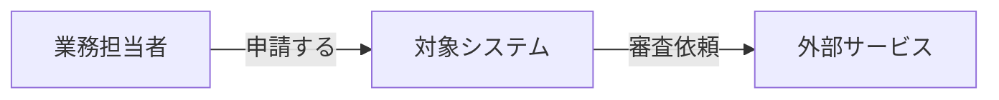
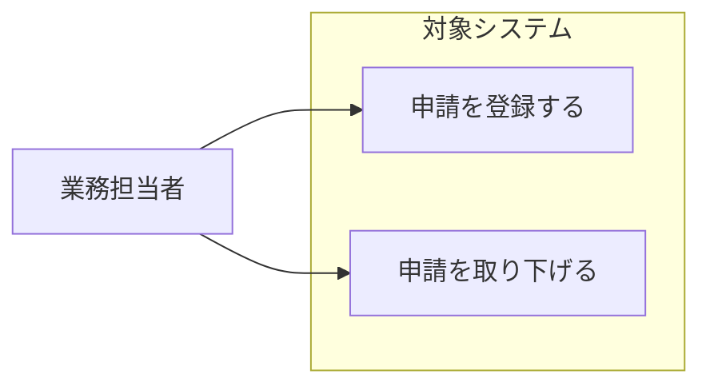
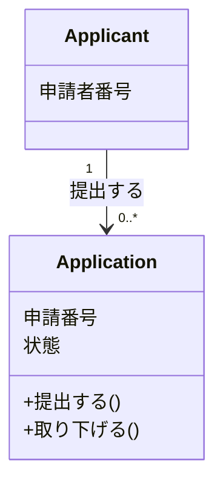
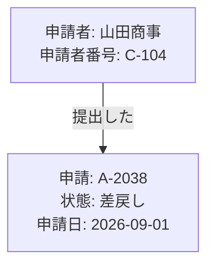

# SUDO・ドメインモデリングガイド

SUDOは、システム関連図（System）、ユースケース図（Use case）、ドメインモデル図（Domain model）、
オブジェクト図（Object）を使い、業務理解を実装可能なモデルへ近づける。
4図すべてを成果物の必須セットにはしない。今回の問いに必要な図だけ作る。

## システム関連図

開発対象、利用者、社内部門、外部組織、外部システムの境界を示す。
矢印には操作または受け渡す情報を書く。

確認すること:

- 開発対象に含むものと含まないもの
- 誰が利用し、誰が結果を受け取るか
- 外部システムとの責任分界
- 各情報の正となる場所

## ユースケース図

画面やAPIではなく、アクターがシステムを使って達成する業務上の目的を示す。
MermaidにはUMLユースケース図がないため、`flowchart`で代替する。

## ドメインモデル図

業務上区別する概念、その関係、多重度、重要なルールを示す。
DBスキーマや実装クラスの設計図にはしない。

- クラス名と関連名は業務用語にする。
- 属性は識別やルールの説明に必要なものだけを書く。
- 操作は業務上意味のある判断や状態変更だけを書く。
- 多重度が不明なら推測で記載しない。
- 重要な制約はnote相当のノード、または図の直後の業務ルール表へ書く。

## オブジェクト図

ドメインモデルへ現実的な具体値を入れ、関係者が想定するケースを成立させられるか検証する。
MermaidにはUMLオブジェクト図がないため、`flowchart`でインスタンスと関係を表す。

最低でも通常例と、認識差が出やすい境界例を1つずつ確認する。

- 0件または複数件
- 取消・差戻し・再申請
- 締め日や期限の前後
- 登録後に元情報が変更された場合
- 同じ対象への重複操作

## モデル間の整合性

- システム関連図のアクターが、ユースケース図にも対応しているか。
- ユースケースで使う名詞と動詞が、ドメインモデルで説明できるか。
- ドメインモデルの関係とルールが、オブジェクト図の具体例で成立するか。
- モデル中の用語が、仕様・画面・API・コードで別の意味になっていないか。

不整合を見つけたらモデルを勝手に統一せず、相違点、影響、判断者を記録する。
