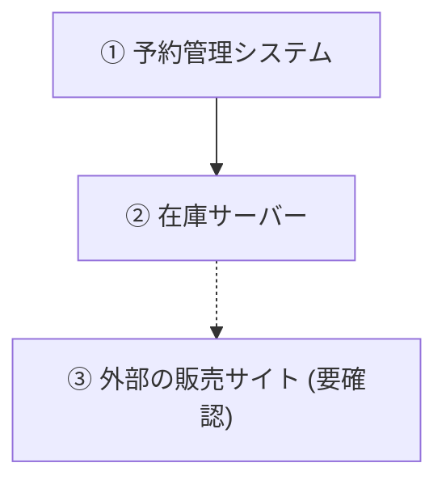

# 図の選び方と形式

## 選択表

| 伝えたいこと           | 図の種類              | mermaid                   | plantUML               |
| ---------------------- | --------------------- | ------------------------- | ---------------------- |
| 誰が誰をいつ呼ぶか     | シーケンス図          | `sequenceDiagram`         | `@startuml` + 参加者   |
| 業務・処理の手順と分岐 | フロー図              | `flowchart TB`            | activity               |
| 何がどこにあるか       | 構成図                | `flowchart TB` + subgraph | component / deployment |
| データの関係           | ER図                  | `erDiagram`               | entity                 |
| 体制・責任分担         | 組織図 / スイムレーン | `flowchart TB`            | activity + partition   |

迷ったら「時間の順序があるか」で分ける。
あればシーケンス図かフロー図、なければ構成図・ER図・組織図。

## 形式

- md本文の中の図はmermaidで書く
- 独立したファイルにする図、要素が20を超える図はplantUMLで書き、1図1ファイルにする
- AA（テキストの罫線図）は使わない
- 向きは縦長を既定にする（mermaid `TB`、plantUML `top to bottom direction`）。横長は時系列の短い図に限る

## 本文との結びつけ

- 図の直前に「この図で何を見てほしいか」を1文で書く
- 本文から図の要素を指すときは①②③を振り、図のラベルにも同じ番号を入れる

- 確認していない要素は破線にして「(要確認)」を付ける
- 1図に主張は1つ。説明したいことが2つあれば図を2枚にする
