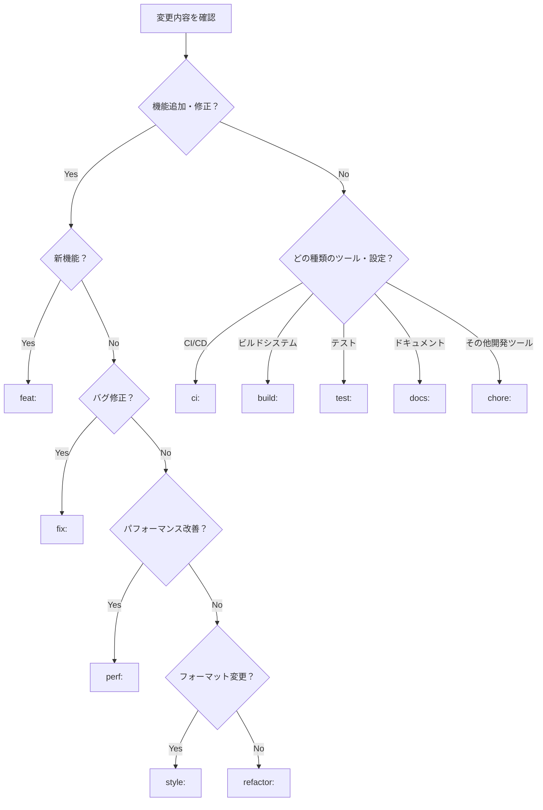

## 重要事項

- コミット対象は**ステージングされている内容**のみです。
  - ステージングされていないファイルをgit addしない。コミット対象はユーザーが意図的にステージした変更のみであり、意図しないファイルの追加はコミット履歴を汚染する。
- pre-commitでエラーが発生した場合は、自動修正せずにエラー内容を報告して終了する。pre-commitエラーの原因はこのスキルの責務外であり、ユーザーが修正方針を判断すべきため。

## コミット作成の手順

1. **ステージングされている変更内容を確認する**

   ```bash
   git status
   git diff --cached
   ```

2. **Conventional Commitに従って日本語で簡潔で分かりやすいコミットメッセージを作成する**

### Conventional Commitのprefix一覧

- `feat:` - 新機能の追加
- `fix:` - バグ修正
- `docs:` - ドキュメントのみの変更
- `style:` - コードの動作に影響しない変更（空白、フォーマット、セミコロンの欠落など）
- `refactor:` - バグ修正や機能追加ではないコードの変更
- `perf:` - パフォーマンスを向上させるコードの変更
- `test:` - テストの追加や既存テストの修正
- `chore:` - ビルドプロセスや補助ツールの変更、ライブラリのアップデートなど
- `ci:` - CI設定ファイルやスクリプトの変更
- `build:` - ビルドシステムや外部依存関係に影響する変更

### prefixの使い分け

#### 判断フローチャート



#### 詳細な使い分け

- **エンドユーザー向けアプリケーション機能**:
  - **新機能追加時**: `feat:`
  - **バグ修正時**: `fix:`
  - **リファクタリング時**: `refactor:`

- **開発ツール・補助ツール関連**:
  - **Claude Code設定変更**: `chore:` (.claude/ディレクトリ内の変更)
  - **その他開発支援ツール**: `chore:`
  - **パッケージ更新・設定変更**: `chore:`
  - **CI/CD設定**: `ci:`

- **その他**:
  - **テスト追加・修正時**: `test:`
  - **ドキュメント更新時**: `docs:`
